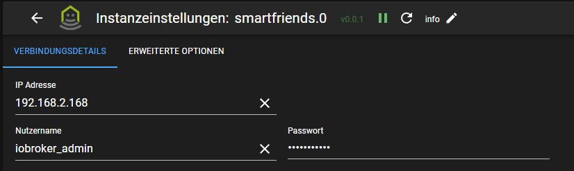

# SmartFriends - Benutzerhandbuch

## Voraussetzungen

Um diesen Adapter korrekt verwenden zu können, müssen folgende Vorbereitungen getroffen werden:

- Gateway eingerichtet und IP-Adresse bekannt
- (Empfehlenswert) Eigenen Benutzer für den Adapter anlegen, damit es zu keinen Konflikten kommt
- Alle zu steuernden Geräte am Gateway registriert und konfiguriert

### Unterstützte Geräte

Aktuell werden folgende Gerätetypen unterstützt:

- Funk-Markisenantrieb (Typ ${Awning})
- Rollladenantrieb (Typ "${RollingShutter}")

Sollten bisher nicht unterstützte Gerätetypen verwendet werden, so werden die entsprechenden Geräte ignoriert. Bitte in diesem Fall einen Issue mit einem vollständigen Debug-Log anlegen, damit der Gerätetyp aufgenommen werden kann.

## Konfiguration

### Verbindungsdetails

An dieser Stelle kann die jeweilige Adapter-Instanz konfiguriert werden. Zwingend nötig für die Funktionalität sind die Zugangsdaten (Benutzername und Passwort) und die IP-Adresse des SmartFriend-Gateways.

### Erweiterte Optionen

Diese Einstellungen müssen in der Regel nicht geändert werden, solange man eine SmartFriendsBox einsetzt. Bei Verwendung eines anderen kompatiblen Gateways müssen die Parameter entsprechend angepasst werden. Dazu die SmartFriends-App öffnen und folgende Schritte ausführen:

Zusätzlich kann hier das Ignorieren von SSL-Fehlern aktiviert werden. Dies sollte nur im Ausnahmefall, z.B. bei Zertifikatsfehlern, verwendet werden.

## Objekte

Nachdem die Adapter-Instanz (X) erfolgreich (=grün) gestartet wurde, werden die Geräte inklusive Daten aus dem Gatewway abgerufen. Für jedes unterstützte Gerät (Y) wird ein separater Objekt-Knoten angelegt.

### smartfriends.X.info

| ID         | lesbar | änderbar | Bemerkung                                 |
| ---------- | :----: | :------: | ----------------------------------------- |
| connection |   X    |    -     | Gibt den Verbindungsstatus zum Gateway an |

### smartfriends.X.gateway

| ID           | lesbar | änderbar | Bemerkung                            |
| ------------ | :----: | :------: | ------------------------------------ |
| hardwareName |   X    |    -     | Name des verwendeten Gateways        |
| macAddress   |   X    |    -     | MAC-Adresse des verwendeten Gateways |

### smartfriends.X.device.Y.info

| ID          | lesbar | änderbar | Bemerkung                           |
| ----------- | :----: | :------: | ----------------------------------- |
| designation |   X    |    -     | Gerätebezeichnung                   |
| deviceName  |   X    |    -     | Benutzerdefinierter Name des Geräts |
| typeClient  |   X    |    -     | Gerätetyp                           |

### smartfriends.X.device.Y.control

Diese States sind abhängig vom Gerätetypen.

#### Funk-Markisenantrieb

| ID       | lesbar | änderbar | Bemerkung         |
| -------- | :----: | :------: | ----------------- |
| moveDown |   -    |    X     | Antrieb ausfahren |
| moveStop |   -    |    X     | Antrieb stoppen   |
| moveUp   |   -    |    X     | Antrieb einfahren |

#### Rollladenantrieb

| ID       | lesbar | änderbar | Bemerkung          |
| -------- | :----: | :------: | ------------------ |
| close    |   -    |    X     | Rolladen schließen |
| moveStop |   -    |    X     | Antrieb stoppen    |
| open     |   -    |    X     | Rolladen öffnen    |
