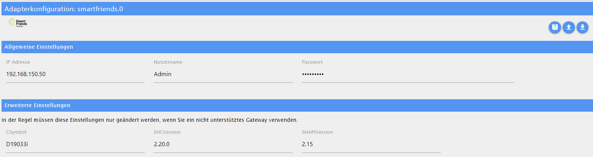

# SmartFriends - Benutzerhandbuch

## Voraussetzungen

Um diesen Adapter korrekt verwenden zu können, müssen folgende Vorbereitungen getroffen werden:

- ...

### Unterstützte Geräte

...

## Konfiguration

### Allgemeine Einstellungen

An dieser Stelle kann die jeweilige Adapter-Instanz konfiguriert werden. Zwingend nötig für die Funktionalität sind die Zugangsdaten (Benutzername und Passwort) und die IP-Adresse des SmartFriend-Gateways.
...

### Erweiterte Einstellungen

Diese Einstellungen müssen in der Regel nicht geändert werden, solange man eine SmartFriendsBox einsetzt. Bei Verwendung eines anderen kompatiblen Gateways müssen die Parameter entsprechend angepasst werden. Dazu die SmartFriends-App öffnen und folgende Schritte ausführen:

## Objekte

Nachdem die Adapter-Instanz (X) erfolgreich (=grün) gestartet wurde, werden die Geräte inklusive Daten aus dem Gatewway abgerufen. Für jedes unterstützte Gerät (Y) wird ein separater Objekt-Knoten angelegt.

### smartfriends.X.info

| ID         | lesbar | änderbar | Bemerkung                                 |
| ---------- | :----: | :------: | ----------------------------------------- |
| connection |   X    |    -     | Gibt den Verbindungsstatus zum Gateway an |

### smartfriends.X.gateway

| ID  | lesbar | änderbar | Bemerkung |
| --- | :----: | :------: | --------- |
| ... |   X    |    -     | ...       |

### smartfriends.X.device.Y.info

| ID   | lesbar | änderbar | Bemerkung |
| ---- | :----: | :------: | --------- |
| .... |   X    |    -     | ...       |

### smartfriends.X.device.Y.control

| ID   | lesbar | änderbar | Bemerkung |
| ---- | :----: | :------: | --------- |
| .... |   X    |    -     | ...       |
