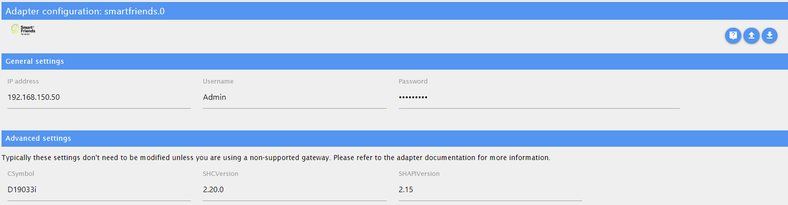
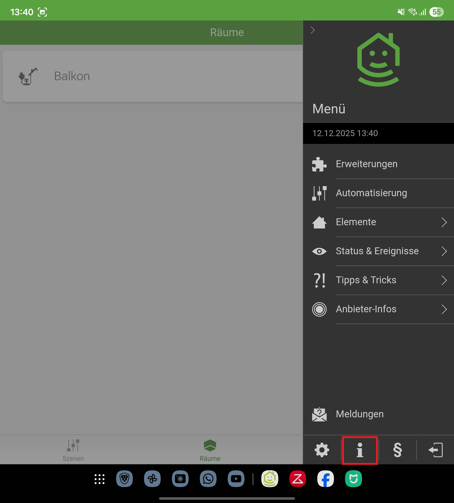
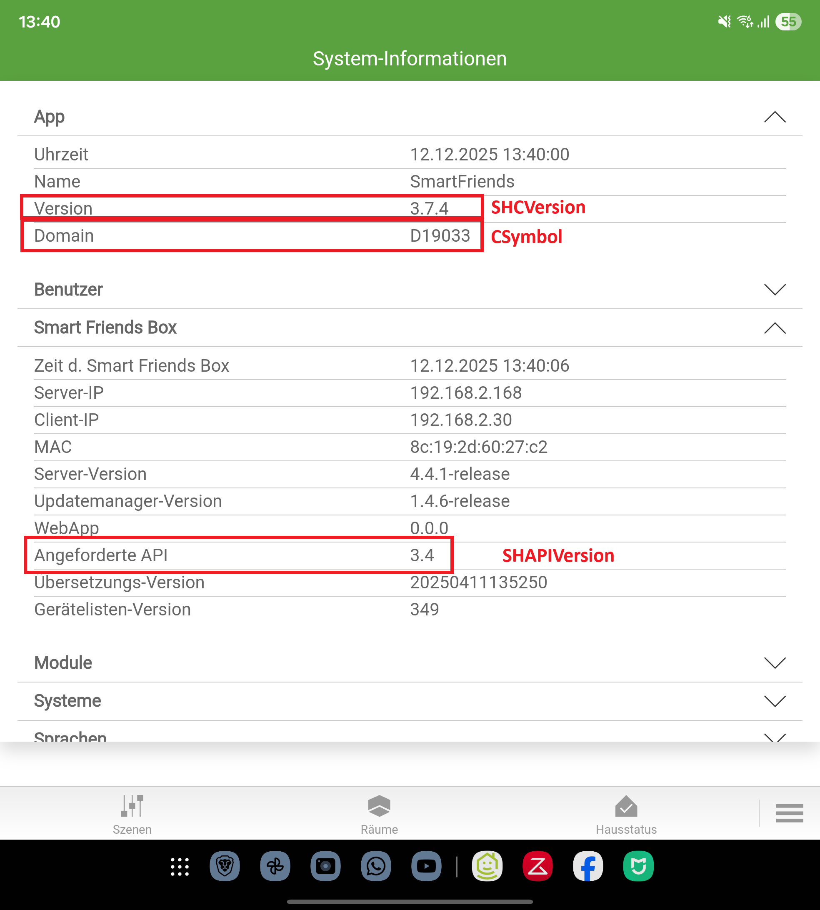

# SmartFriends - User guide

## Prerequisites

To use this adapter correctly, the following preparations must be made:

- Gateway set up and IP address known
- (Recommended) Create a dedicated user for the adapter to avoid conflicts
- All devices to be controlled registered and configured on the gateway

### Supported devices

Currently, the following device types are supported:

- Wireless awning drive (Type ${Awning})
- Roller shutter drive (Type "${RollingShutter}")

If device types that are not yet supported are used, the corresponding devices will be ignored. In this case, please create an issue with a complete debug log so that the device type can be added.

## Configuration

### Connection details

Here, you can configure the specific adapter instance. The login credentials (username and password) and the IP address of the SmartFriend gateway are required for proper functionality.

### Advanced options

These settings usually do not need to be changed as long as a SmartFriendsBox is used. If using another compatible gateway, the parameters must be adjusted accordingly. Open the SmartFriends app and follow these steps:

Additionally, ignoring SSL errors can be enabled here. This should only be used in exceptional cases, e.g., for certificate errors.

## Objects

Once the adapter instance (X) is successfully (=green) started, devices and data from the gateway are retrieved. For each supported device (Y), a separate object node is created.

### smartfriends.X.info

| id         | read | write | comment                                 |
| ---------- | :--: | :---: | --------------------------------------- |
| connection |  X   |   -   | Indicates the connection to the Gateway |

### smartfriends.X.gateway

| ID           | read | write | comment                         |
| ------------ | :--: | :---: | ------------------------------- |
| hardwareName |  X   |   -   | Name of the used gateway        |
| macAddress   |  X   |   -   | MAC address of the used gateway |

### smartfriends.X.device.Y.info

| ID          | read | write | comment                         |
| ----------- | :--: | :---: | ------------------------------- |
| designation |  X   |   -   | Device designation              |
| deviceName  |  X   |   -   | User-defined name of the device |
| typeClient  |  X   |   -   | Device type                     |

### smartfriends.X.device.Y.control

These states depend on the device type.

#### Wireless Awning Drive

| ID       | read | write | comment            |
| -------- | :--: | :---: | ------------------ |
| moveDown |  -   |   X   | Extend the awning  |
| moveStop |  -   |   X   | Stop the drive     |
| moveUp   |  -   |   X   | Retract the awning |

#### Roller Shutter Drive

| ID       | read | write | comment           |
| -------- | :--: | :---: | ----------------- |
| close    |  -   |   X   | Close the shutter |
| moveStop |  -   |   X   | Stop the drive    |
| open     |  -   |   X   | Open the shutter  |
